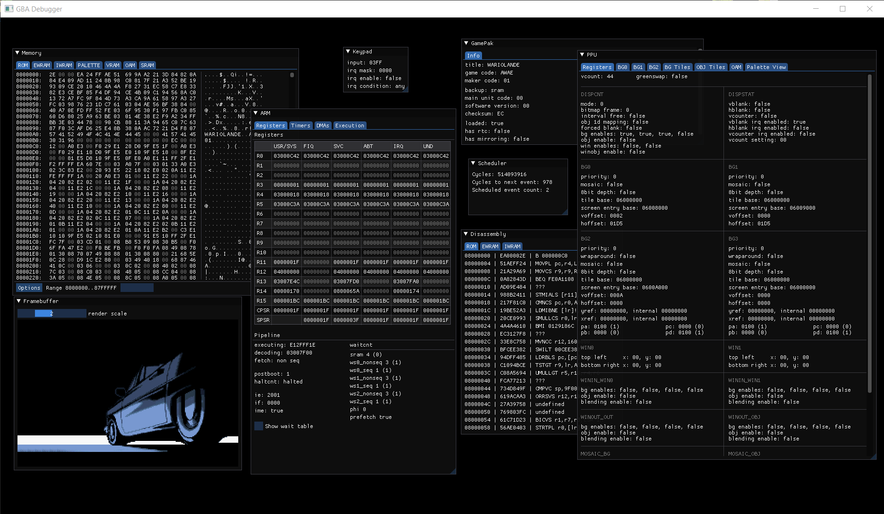

# gameboi advance

[](https://travis-ci.com/emrsmsrli/gameboiadvance)
[](https://github.com/emrsmsrli/gameboiadvance/blob/master/LICENSE)

A Gameboy Advance emulator built upon the GBC emulator [gameboi](https://github.com/emrsmsrli/gameboi/)

## Features

gameboiadvance does not aim to be the perfect emulator,
its features are limited compared to other emulators.

- Accurate ARM7 emulation
- Scanline based PPU emulation 
- Accurate DMA interleaving
- EEPROM, FLASH and SRAM save-load capability
- RTC support _(sadly, no other GPIO extensions)_
- Disassembler and a powerful debugger
  - Capable of showing all of the internals of the emulator
  - Execution and data access breakpoint support
  
### Feature TODO
- Gamepak prefetch emulation
- APU emulation (based on [gameboi](https://github.com/emrsmsrli/gameboi/))
- SIO emulation, and networked multiplayer support (TODO)

## Screenshots

<p align="center">
    
    
    
</p>
<p align="center">
    
    
    
</p>
<p align="center">
    
</p>

## Using as a library

gameboiadvance library can be easily integrated to your own frontend implementation:
```cpp
#include <gba/core.h>

// WITH_DEBUGGER can be set with cmake argument -DWITH_DEBUGGER=ON
#if WITH_DEBUGGER
  #include <gba_debugger/debugger.h>
#endif //WITH_DEBUGGER

void on_scanline(const gba::u8 line_number, const gba::ppu::scanline_buffer& buffer) noexcept;
void on_vblank() noexcept;
void on_audio(const gba::apu::sound_buffer& buffer) noexcept;

int main(int argc, char** argv) 
{
    // bios is required to boot
    gba::core gba{"file/path/to/bios.gba"};
    gba.load_pak("file/path/to/rom.gba");

#if WITH_DEBUGGER
    gba::debugger::window debugger_window(&gba);
#endif //WITH_DEBUGGER

    gba.ppu.event_on_scanline.add_delegate(gba::connect_arg<&on_scanline>);
    gba.ppu.event_on_vblank.add_delegate(gba::connect_arg<&on_vblank>);
    gba.apu.on_audio_buffer_full.add_delegate(gba::connect_arg<&on_audio>);

    while(true) {
        // gba.press_key(gba::keypad::key::a);
        // gba.release_key(gba::keypad::key::start);

#if WITH_DEBUGGER
        // debugger window handles input, video and audio output
        debugger_window.tick();
#elif
        gba.tick_one_frame();
        // or gba.tick(n); which executes n instructions every iteration
#endif //WITH_DEBUGGER
    }

    return 0;
}
```

## Compiling
### Dependencies
- CMake 3.16
- fmt (as git submodule)
- spdlog (as git submodule)
- SFML
- SDL2 (for sound only)

Install dependencies however you like. Below example is installing using vcpkg, in Ubuntu:

```shell
$ git clone https://github.com/Microsoft/vcpkg.git
$ ./vcpkg/bootstrap-vcpkg.sh -disableMetrics
$ ./vcpkg/vcpkg install sfml sdl2
$ sudo apt install cmake
```

### Compile using CMake
gameboiadvance uses CMake and can be easily built with a script like below.

```shell
$ mkdir build && cd build
$ cmake --config Release --target gameboiadvance ..
$ cmake --build -- -j $(nproc)
```
